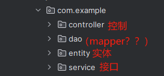

## 创建一个SpringBoot文件
### 1创建一个普通项目
### 2在pom中添加依赖
```dtd
<parent>
        <groupId>org.springframework.boot</groupId>
        <artifactId>spring-boot-starter-parent</artifactId>
        <version>2.1.13.RELEASE</version>
        <relativePath/>
    </parent>
```
注意报错,拉到最右边看
```dtd
 Failed to read candidate component class: file [C:\Users\82419\IdeaProjects\s_m\target\classes\com\example\TeachApplication.class]; nested exception is org.springframework.core.NestedIOException: ASM ClassReader failed to parse class file - probably due to a new Java class file version that isn't supported yet: file [C:\Users\82419\IdeaProjects\s_m\target\classes\com\example\TeachApplication.class]; nested exception is java.lang.IllegalArgumentException: Unsupported class file major version 65
```
pom.xml 中改为8
```dtd
  <properties>
        <maven.compiler.source>8</maven.compiler.source>
        <maven.compiler.target>8</maven.compiler.target>
        <project.build.sourceEncoding>UTF-8</project.build.sourceEncoding>
    </properties>
```
### 3创建3层结构

### 4编写查询代码

### 5编写mybatis


## ！！**注意文件结构和注解**